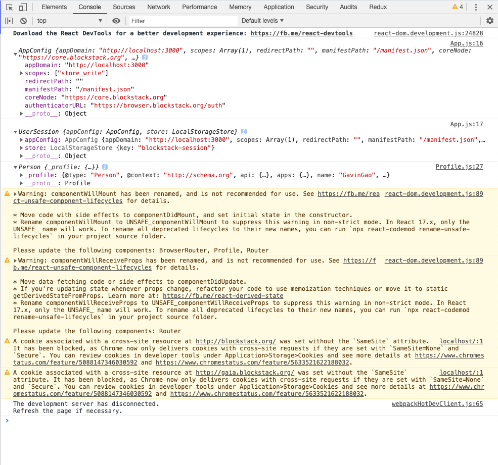

本项目以 [Create React App](https://github.com/facebook/create-react-app) 为框架启动

### `npm install`
安装依赖包

### `npm start`
运行程序，在 localhost:3000 端口查看应用执行情

### 执行情况

- 登入后显示主界面
- “你好、个人简介”等文字在 Profile.js 中可以查看

- 打开检查
- AppConfig
- UserSession
- Person
- 对应代码查看相应内容
